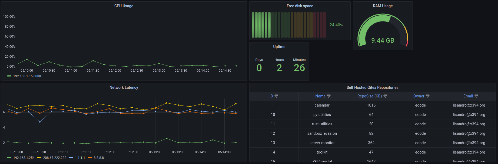

# Current Grafana Dashboard

---
# Metrics collected

---
## Hardware Metrics
### CPU
| **Metric**    | **Description** | **Type** | **Unit** |
|---------------|-----------------|----------|----------|
| **CPUUser**   | CPU user        | Gauge    | %        |
| **CPUNice**   | CPU Nice        | Gauge    | %        |
| **CPUSys**    | CPU idle        | Gauge    | %        |
| **CPUIntr**   | CPU Interrupts  | Gauge    | %        |
| **CPUIdle**   | CPU CPU idle    | Gauge    | %        |
| **CPUStates** | CPU States      | Gauge    | %        |
| **CPUTemp**   | CPU States      | Counter  | %        |

### Memory
| **Metric** | **Description**       | **Type** | **Unit** |
|------------|-----------------------|----------|----------|
| **Total**  | Total memory          | Gauge    | Bytes    |
| **Free**   | Available free memory | Gauge    | Bytes    |
| **Usage**  | Memory Used           | Gauge    | Bytes    |

### Disk
| **Metric**      | **Description** | **Type** | **Unit** |
|-----------------|-----------------|----------|----------|
| **Total**       | Total disk      | Gauge    | Bytes    |
| **Free**        | Free disk       | Gauge    | Bytes    |
| **Usage**       | Disk Used       | Gauge    | Bytes    |
| **Percentage ** | Disk Percentage | Gauge    | Bytes    |

---
## Network Metrics
| **Metric**           | **Description**  | **Type** | **Unit** |
|----------------------|------------------|----------|----------|
| **networkLatency**   | networkLatency   | Gauge    | ms       |
| **connectedClients** | connectedClients | Gauge    | Count    |

---
## Software Metrics
### Nginx
| **Metric** | **Description** | **Type** | **Unit** |
|------------|-----------------|----------|----------|
| **Active** | Active          | Gauge    | Count    |
| **Accepts**| Accepts         | Gauge    | Count    |
| **Handled**| Handled         | Gauge    | Count    |
| **Reading**| Reading         | Gauge    | Count    |
| **Writing**| Writing         | Gauge    | Count    |
| **Waiting**| Waiting         | Gauge    | Count    |
| **Total**  | Total           | Gauge    | Count    |

### Gitea
| **Metric**           | **Description**                          | **Type** | **Unit** |
|----------------------|------------------------------------------|----------|----------|
| **Active**           | Active                                   | Gauge    | Count    |
| **gitea_repository** | Gitea Repository (email, name, owner...) | %        | %        |

---
## OS Metrics
### Uptime
| **Metric** | **Description** | **Type** | **Unit** |
|------------|-----------------|----------|----------|
| **Uptime** | Uptime          | Gauge    | Count    |
---
